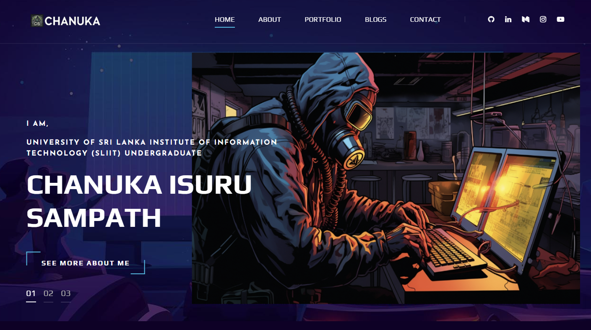

# 🌐 Chanuka Isuru Sampath | Cybersecurity Portfolio Website

  

Welcome to my personal **Cybersecurity Portfolio**! 🚀 This website serves as a hub for my **CTF challenges, penetration testing write-ups, and security research**.  

## 🌎 Live Website  
🔗 **[Visit My Portfolio](https://rio6ix.github.io/chanuka/)** 

## 🔍 About  
I am a **Cybersecurity student, Ethical Hacker, and CTF Creator** passionate about **offensive security, red teaming, and bug bounty hunting**. This portfolio showcases my journey, skills, and contributions to the cybersecurity community.  

## 🔹 Features  
✔ **My CTF Challenges & Projects** – Hacking,Web, Reverse Engineering, Forensics, and Binary Exploitation  
✔ **Bug Bounty & Penetration Testing Write-ups**  
✔ **Cybersecurity Research & Learning Resources**  
✔ **Certifications & Professional Growth**   

## 🛠 Technologies Used  
- HTML, CSS, JavaScript  
- GitHub Pages for hosting  
- Markdown for documentation  

## 🏆 CTF Challenges  - **[link](https://github.com/RIO6IX/My-CTFs)**
I create **Capture The Flag (CTF)** challenges related to:  
- Web Security  
- Binary Exploitation  
- Reverse Engineering  
- Forensics  

Stay tuned for updates as I continue adding more CTF challenges and cybersecurity content!  

## 📌 Get in Touch  
Feel free to connect with me on:  
🔗 **LinkedIn:** [LinkedIn Profile](https://www.linkedin.com/in/chanuka-isuru-sampath-289358247/?profileId=ACoAAD0ZIIkBxXB_u9gVdyWUaQ8JjtJ6sOLMxWc)  
🐙 **GitHub:** [My GitHub](https://github.com/rio6ix)  

If you have feedback, suggestions, or would like to collaborate, feel free to open an issue or reach out!  

**Happy Hacking! 🔒💻**  

